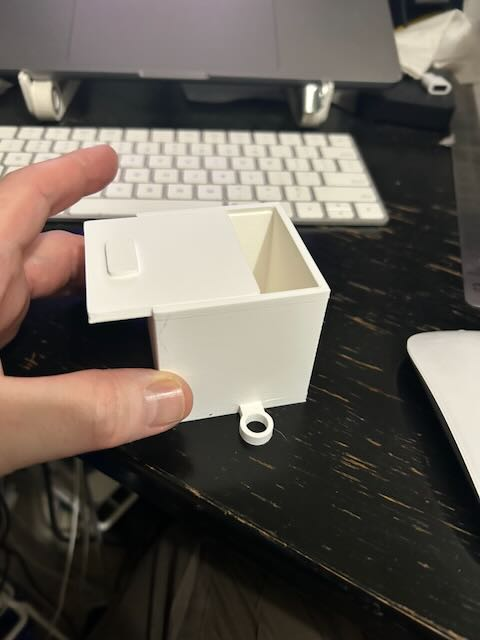
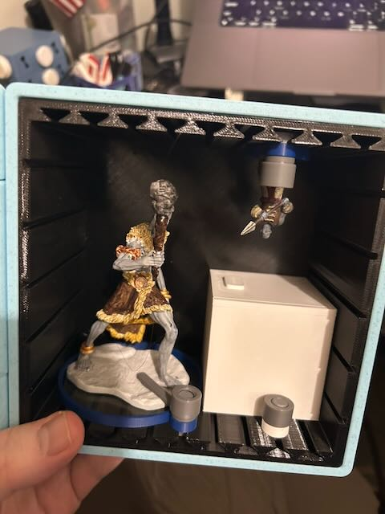

This is my attempt to make box that you can secure to a modi-loop tray.  I downloaded someone elses box and attached a loop with tinkercad.

When you add the loop you can secure it in a ModiBoxi rail 

I have two minis for the campaign I'm a part of.  This box holds both minis and the target box with my dice in it for game days.  The initial box works great - it needs to be slightly offset to align with the spacing of the rails. 
